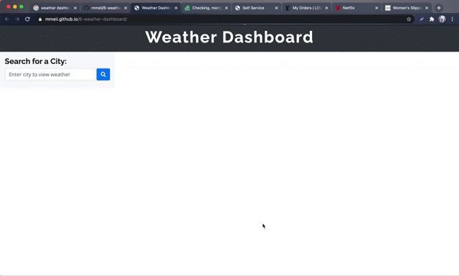

# Weather Dashboard

 

This is a weather dashboard with form inputs that will run in the browser and feature dynamically updated HTML and CSS. It allows the user to search to view weather outlook for multiple cities so travelers can plan a trip accordingly.

[OpenWeather API](https://openweathermap.org/api) is used to retrieve weather data for cities. And `localStorage` is used to store persistent data.

## Installation

1. Download or clone repository
2. Open the main page (index.html) on your browser to view
3. Use a text editor to view all coding, Visual Studio Coding is recommended.

## Functionality

* When searched for a city, the current and future conditions for that city will be presented and that city is added to the search history
  
* When viewing current weather conditions for the city, the following is shown:
  * City name
  * Date
  * An icon representation of weather conditions
  * Temperature
  * Humidity
  * Wind speed
  * UV index
  
* When viewing the UV index, it is presented with a color indicating severity (reference: [Ultraviolet Index Wikipeadia](https://en.wikipedia.org/wiki/Ultraviolet_index#:~:text=A%20UV%20index%20reading%20of,broad%20spectrum%20SPF%2030%2B%20sunscreen.&text=A%20UV%20index%20reading%20of%206%20to%207%20means%20high,harm%20from%20unprotected%20sun%20exposure.))
  *  0-2 Low
  *  3-5 Moderate
  *  6-7 Orange
  *  8-10 Very High
  *  11+ Extreme
  
* When viewing the future weather conditions for the city, a 5-day forecast will be presented with the following information:
  * Date
  * An icon representation of weather conditions
  * Temperature
  * Humidity
  
* When a city in the search history is clicked, the current and future conditions for that city is presented again
* When the weather dashboard is opened, the last searched city forecast is presented
  
## Features

* HTML
* CSS
* Bootstrap
* jQuery
* Moment.js
* Server-Side API - OpenWeather API

## Demo

## Websites

* [Github](https://github.com/mmeii/weather-dashboard)
* [Deployed](https://mmeii.github.io/weather-dashboard/)

## License

  Copyright (c) Mengmei Tu. All rights reserved.
  
  Licensed under the [MIT](LICENSE) license.
